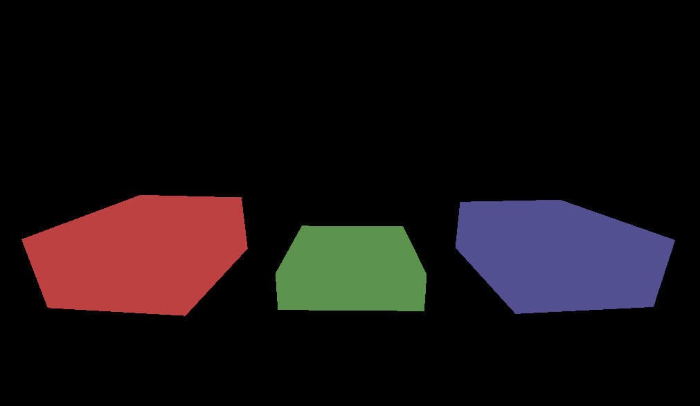

# JustThreeBlocksBackground
 

This is a background scene for my website. You can also use it in [Lively Wallpaper](https://github.com/rocksdanister/lively) with this URL:

https://marmadilemanteater.github.io/godot_background/index.html

### Engine:

This scene was made with Godot which is [licensed under the MIT license](https://godotengine.org/license/).
